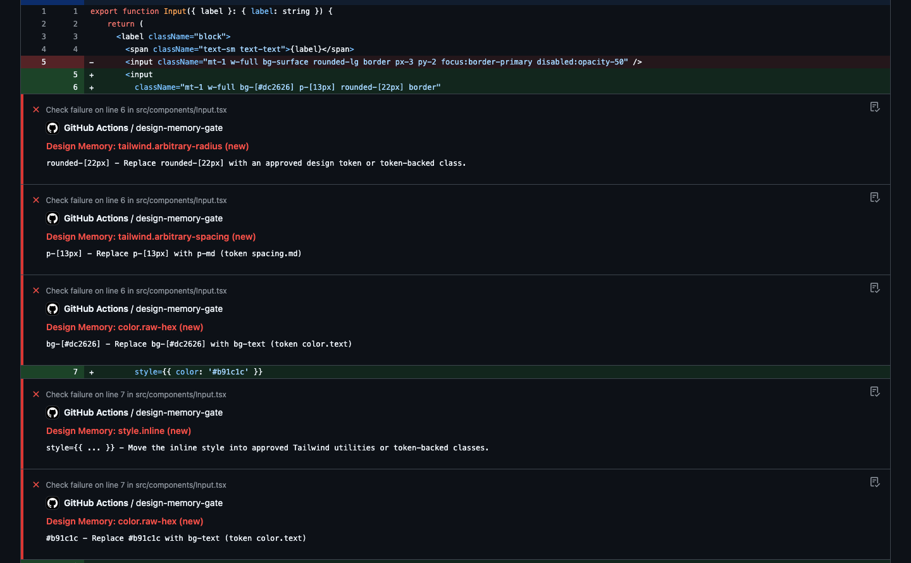

# Design Memory

[](https://github.com/derinbarutcu17/DesignMemory/actions/workflows/ci.yml)
[](https://www.npmjs.com/package/@derinb/design-memory)

**Design Memory blocks design drift in AI-written frontend code. Deterministic, local-first, DTCG-native.**

It sits between your design truth (Figma → tokens.json → DESIGN.md → Tailwind `@theme`) and the agents writing code, blocking net-new drift before a human ever reviews it. No telemetry, no cloud, no LLM required — a CLI, a pre-commit hook, a GitHub Action, and a JSON contract your agent loop can parse.

## The problem

- **The 80% problem.** Roughly 80% of UI code is now AI-written, and agents happily invent colors, spacing, and component patterns. Design reviews have become "catch what the agent broke" — the [Builder.io framing](https://www.builder.io/blog/ai-design-systems) of making the wrong path fail mechanically is the only thing that scales.
- **Five design systems.** Every agent session re-derives your design system from context, so the same repo slowly fragments into five. Enforcement, not documentation, is what stops it.
- **Prose loses to code.** A DESIGN.md tells an agent what to do; a failing check makes it. Documentation is the floor, enforcement is the ceiling.

## The pipeline

```
Figma ──export──> tokens.json (DTCG 2025.10) ──> DESIGN.md ──> @theme CSS
      Tokens Studio / Figma variables commit these to git
                                                      │
                                  design-memory sync-reference
                                                      ▼
                                          reference-snapshot.json
                                                      │
        ┌─────────────────────────────────────────────┼────────────────────────────┐
        ▼                                             ▼                            ▼
   pre-commit hook                          GitHub Action                     agent loop
   design-memory audit                    inline PR annotations            design-memory audit --json
```

## Quickstart (2 minutes)

```bash
npx @derinb/design-memory init            # 1. config + pre-commit hook
npx @derinb/design-memory sync-reference  # 2. snapshot DESIGN.md + tokens.json
git add .
npx @derinb/design-memory audit           # 3. gate your staged changes
npx @derinb/design-memory ghost --write   # 4. generate agent rules files
npx @derinb/design-memory review          # 5. see the memory ledger
npx @derinb/design-memory compare         # 6. resolved vs remaining vs new vs reopened
```

## Three enforcement surfaces

| Surface | How | Exit codes |
| --- | --- | --- |
| Pre-commit hook | `design-memory init` installs a hook running `audit` | 0 clean / 1 drift / 2 no snapshot |
| GitHub Action | `derinbarutcu17/DesignMemory@main` annotates the PR diff inline | check fails on net-new errors |
| Agent loop | `design-memory audit --json` — pure JSON on stdout, human output on stderr | same codes; agent parses with `jq` |

GitHub Action:

```yaml
- uses: derinbarutcu17/DesignMemory@main
  with:
    strictness: block   # or warn for advisory-only
```

Live proof: [PR #1 on the demo repo](https://github.com/derinbarutcu17/design-memory-demo/pull/1) — raw hex, arbitrary padding/radius, and an inline style added by "the agent" — the check failed with annotations on the exact lines:



## The memory layer (no competitor has this)

Every finding gets a stable fingerprint. Design Memory remembers what happened to it:

```bash
design-memory audit --create-baseline                # adopt on an existing repo
# Future runs block only net-new or reopened drift. Existing drift is listed, never re-blocks.

design-memory review --fingerprint abc123 --status intentional --note "shipping as-is"
# The remembered decision keeps that finding out of every future blocking run.

design-memory review --export                        # markdown ledger: rule, file:line, status, note, timestamps
design-memory compare                                # Resolved / Remaining / New / Reopened
```

This makes adoption safe on brownfield codebases: the gate starts blocking the *next* piece of drift, not your entire backlog.

## DTCG-native reference

`sync-reference` reads the actual 2026 token pipeline — W3C DTCG Design Tokens ([stable Oct 2025](https://design-tokens.github.io/community-group/format/), backed by Adobe, Google, Meta, Figma), the format Tokens Studio and Figma variable exports commit to git:

```jsonc
// tokens.json
{
  "color": { "primary": { "$value": "#2563eb", "$type": "color" } },
  "spacing": { "md": { "$value": "16px", "$type": "spacing" } }
}
```

```jsonc
// design-memory.config.json
{
  "reference": {
    "sourceType": "dtcg",
    "path": "./tokens.json",
    "designMdPath": "./DESIGN.md"   // tokens from DTCG, component contracts from DESIGN.md
  }
}
```

Token names become code hints automatically (`color.primary` → `bg-primary`, `text-primary`, `border-primary`), so `token.mismatch` enforcement works with zero hand-written configuration. `DESIGN.md` in the Google Stitch format parses natively (numbered sections, color roles, component bullets, token tables), and `ghost --format design-md` regenerates a spec-aligned DESIGN.md from the snapshot — the tool is a DESIGN.md author, not just a reader.

## Ghost: the agent design pack

`design-memory ghost --write` generates every agent-facing artifact from the snapshot in one command — `.cursor/rules/design.mdc`, `CLAUDE.md` / `AGENTS.md` / `copilot-instructions.md` / `.clinerules` sections (marker-based, idempotent), `design-tokens.md`, and `DESIGN.md`. Every file is a slim list of exact tokens and classes, and ends with:

> Violations are enforced by: design-memory audit (pre-commit, CI, and agent loop).

Run it once with no args to see the plan; `--write` applies it.

## Rules

| Rule | Severity | What it catches |
| --- | --- | --- |
| `color.raw-hex` | error | hex in arbitrary-value classes / inline styles, not in tokens or `@theme` |
| `tailwind.arbitrary-spacing` | error | arbitrary spacing not backed by a `@theme` spacing token |
| `tailwind.arbitrary-radius` | error | arbitrary radius not backed by a `@theme` radius token |
| `tailwind.arbitrary-font-size` | warn | arbitrary font sizes not backed by the typography scale |
| `style.inline` | error | `style={{ ... }}` in audited UI files |
| `token.mismatch` | error | component changed without referencing its approved tokens |
| `component.required-pattern` | error | contract line (`Must use:`) not honored |
| `component.disallowed-pattern` | error | contract line (`Disallowed:`) violated |
| `component.variant-drift` | warn | variant values outside the approved set |
| `component.missing-state` | warn | contract state (hover/focus/disabled/...) absent |

Every finding names the exact replacement: `Replace p-[9px] with p-sm (token spacing.sm)` — the closest token from the reference, so agents repair instead of inventing new token names.

## Architecture

One paragraph: `ast.ts` extracts only real `className`/`style` JSX attributes (never comments or strings) with 1-based line/column; `theme.ts` parses Tailwind v4 `@theme` blocks so arbitrary values backed by the repo's own tokens pass; `audit.ts` diff-scopes every finding to lines actually changed in this PR (net-new semantics); `state.ts` keeps the snapshot, run history, baseline, and reviews in `.design-memory/` — pure local files, no database, no telemetry.

## Commands

```bash
design-memory init                    # config + pre-commit hook
design-memory sync-reference          # DESIGN.md / tokens.json / Stitch / Figma -> snapshot
design-memory audit [--json] [--create-baseline]
design-memory scan --pr=123           # gh CLI-backed PR audit
design-memory review [--export] [--fingerprint X --status intentional --note "..."]
design-memory compare
design-memory ghost [--write] [--format design-md]
```

## Config

```jsonc
{
  "strictness": "block",
  "stateDir": ".design-memory",
  "reference": {
    "sourceType": "dtcg",              // design-md | stitch-markdown | figma | dtcg
    "path": "./tokens.json",           // for dtcg; else ./DESIGN.md
    "designMdPath": "./DESIGN.md",     // optional: components from DESIGN.md, tokens from DTCG
    "strictDesignMd": false
  },
  "include": ["src/components/**/*.tsx", "src/app/**/*.tsx"],
  "exclude": ["src/lib/**", "**/*.test.tsx", "**/*.test.ts"],
  "rules": { "color.raw-hex": "error", "tailwind.arbitrary-spacing": "error", /* ... */ },
  "baseline": { "mode": "net-new-only" },
  "llmFallback": { "enabled": false, "mode": "explain-only" },
  "visualProvider": "none"
}
```

## Demo

```bash
npm install
npm run build
npm run demo:design-memory:audit
```

Six acts against the real engine, in a throwaway git repo: sync → baseline a brownfield → clean pass → drift blocked with exact line/column and closest-token suggestions → theme-backed arbitrary values pass → a finding reviewed as `intentional` no longer blocks. The showcase is a real Vite + React + Tailwind v4 app (`examples/design-memory-showcase/`).

## Roadmap

- DTCG `$type` coverage for shadows/gradients in token enforcement
- Precompiled-CSS checking once source-level is bulletproof
- Visual diffing: **explicitly out** — flaky, crowded, Argos already owns it

## Development

```bash
npm install
npm run build && npm test && npm run lint
npm run demo:design-memory:audit
```

CI runs TypeScript, ESLint, and the test suite on Node 18/20/22.
