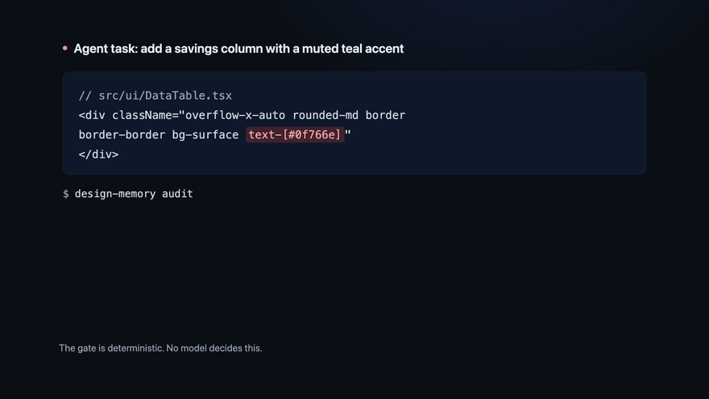
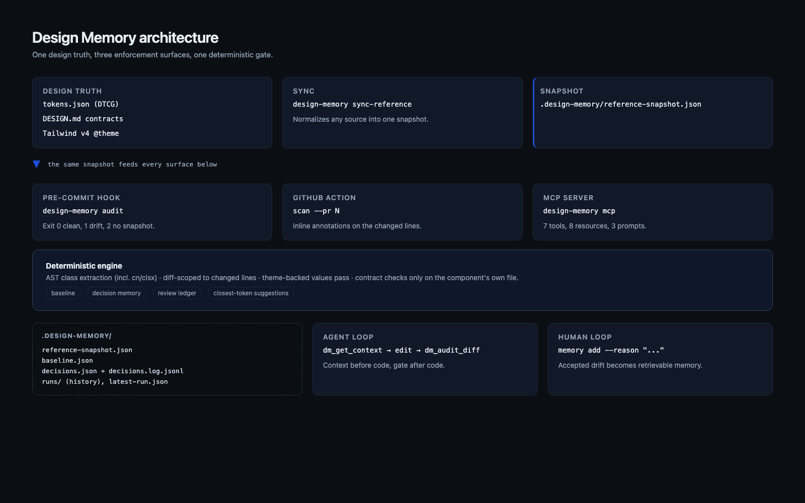
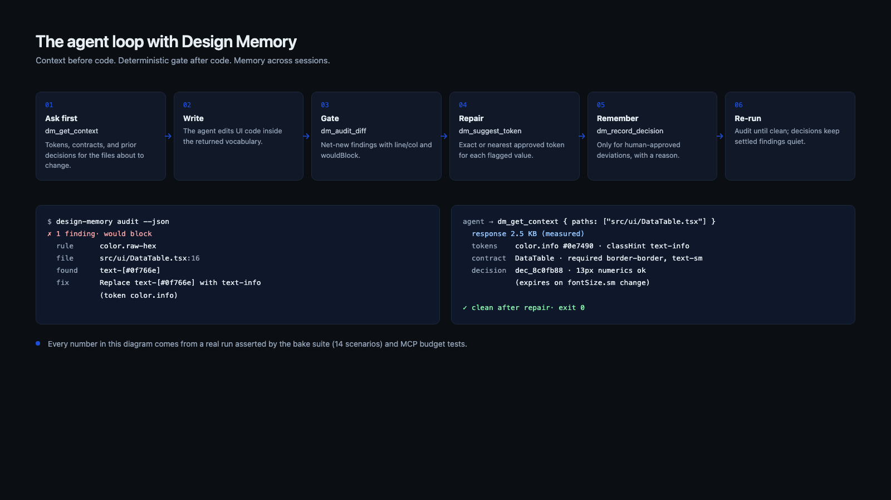
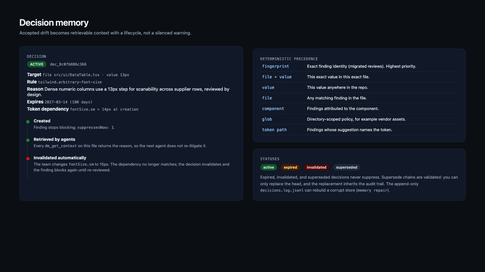
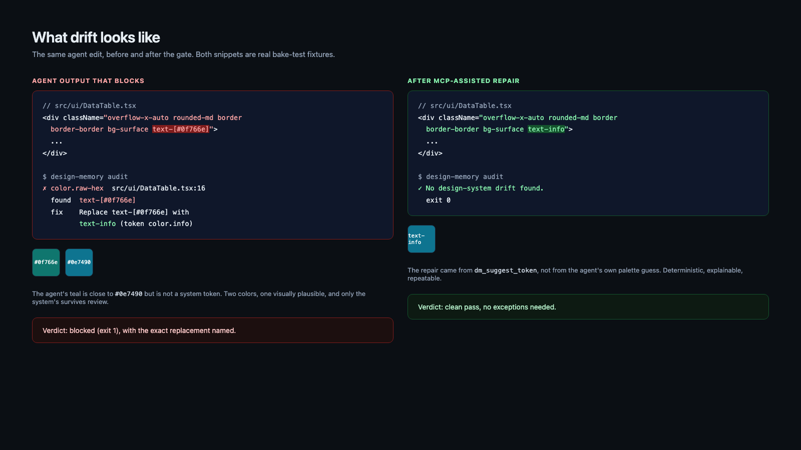
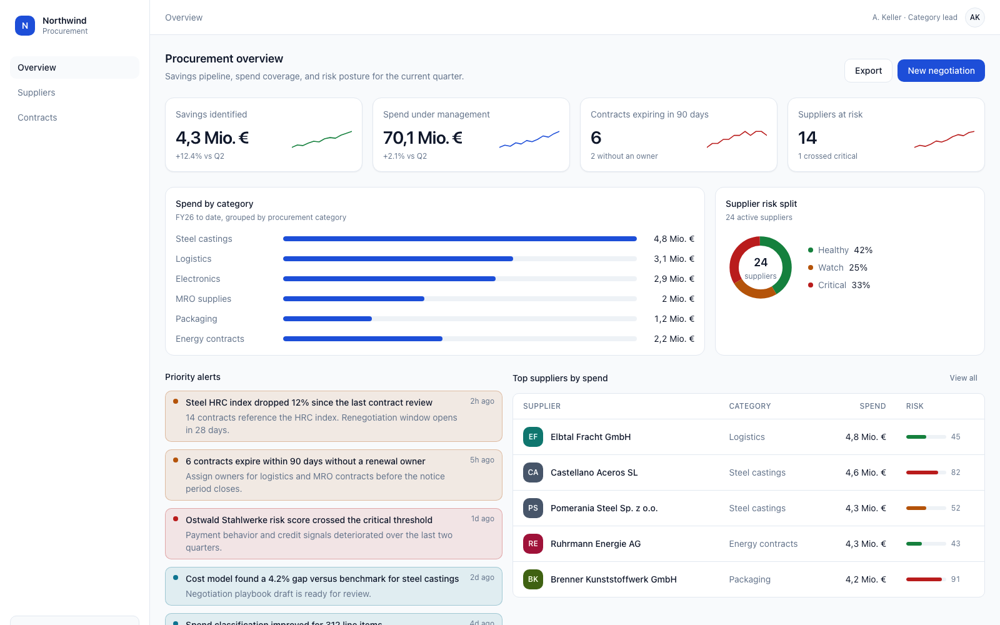
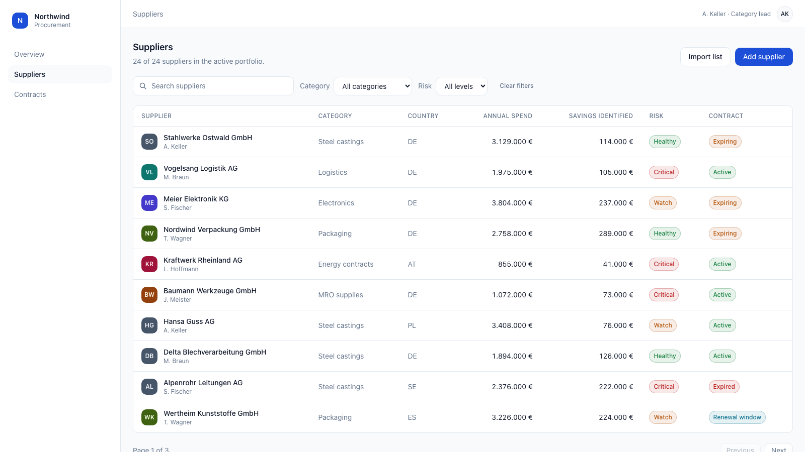
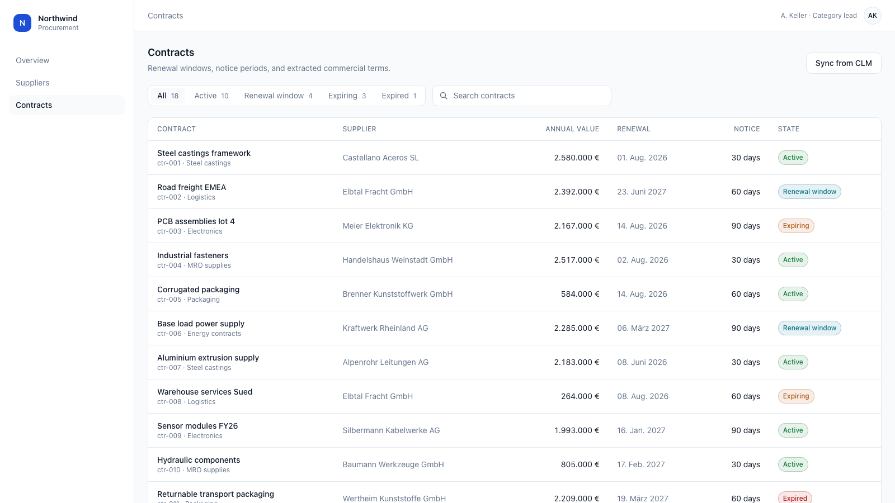

# Design Memory

[](https://github.com/derinbarutcu17/DesignMemory/actions/workflows/ci.yml)
[](https://github.com/derinbarutcu17/DesignMemory/releases)
[](LICENSE)

**The deterministic memory and guardrail layer between your design system and the agents writing your frontend.**

Design Memory sits between your design truth (Figma → `tokens.json` → `DESIGN.md` → Tailwind `@theme`) and the coding agents. It blocks net-new drift before a human ever reviews it, and it gives agents the context they need before they write: tokens, component contracts, and previous decisions, over MCP. Deterministic, local-first, DTCG-native. No telemetry, no cloud, no LLM in the gate.



## Who this is for

Teams shipping UI with coding agents, where more than one person writes frontend code and nobody has time to police every commit by hand. It pays off fastest when a repo already has a token file or a `DESIGN.md`, and it is deliberately small: one config file, one state directory, no service to run.

Not for you if: you want a general frontend linter (use ESLint), you want visual regression (use Argos or Chromatic), or your UI is not React/Tailwind (see [limits](#limits-and-non-goals)).

## The problem

- **The 80% problem.** Most UI code is now AI-written, and agents happily invent colors, spacing, and component patterns. Review has become "catch what the agent broke."
- **Five design systems.** Every agent session re-derives your design system from context, so the same repo slowly fragments into five.
- **Prose loses to code.** A `DESIGN.md` tells an agent what to do; a failing check makes it. Documentation is the floor, enforcement is the ceiling.

## What Design Memory does differently

- **Net-new-only enforcement.** A baseline plus decision memory means adoption on a brownfield codebase never blocks the backlog. Only new or reopened drift blocks. ([details](#decision-memory))
- **Deterministic gate.** No model decides pass or fail. The rules are regex, AST, and contract checks with exact line/column and a closest-token suggestion on every finding.
- **Memory, not just lint.** Accepted deviations are recorded with a reason, an optional expiry, and optional token dependencies. When the token changes, the exception invalidates itself.
- **Agent-readable over MCP.** Agents ask for design context before writing (`dm_get_context`) instead of guessing from prose. Responses are compact, capped, and budget-tested.

## Architecture



One reference snapshot feeds three enforcement surfaces (pre-commit hook, GitHub Action, agent loop) and one memory store. Everything lives in `.design-memory/` as plain files:

```
tokens.json + DESIGN.md ──sync-reference──> .design-memory/reference-snapshot.json
                                                   │
                 ┌─────────────────────────────────┼──────────────────────────────┐
                 ▼                                 ▼                              ▼
          pre-commit hook                    GitHub Action                  MCP server
          design-memory audit              inline PR annotations          design-memory mcp
                 │                                 │                              │
                 └──────────────> .design-memory/  <──────────────────────────────┘
                       baseline.json · decisions.json · decisions.log.jsonl · runs/
```

| Module | Responsibility |
| --- | --- |
| `src/lib/ast.ts` | Extracts only real `className`/`style` JSX usages, including `cn()`/`clsx()` helpers, with 1-based line/column. Never comments or plain strings. |
| `src/lib/theme.ts` | Parses Tailwind v4 `@theme` so arbitrary values backed by the repo's own tokens pass. |
| `src/lib/audit.ts` | Diff-scopes every finding to lines actually changed, applies baseline and decision memory, derives statuses. |
| `src/lib/memory/` | Decision schema, lifecycle (expiry, invalidation, supersede), precedence lookup, repair from the append log. |
| `src/lib/api.ts` | The single programmatic surface shared by the CLI and the MCP server, so the two can never drift apart. |
| `src/mcp/` | Stdio MCP server: 7 tools, 8 resources, 3 prompts. No shell-outs, deterministic output, byte budgets in tests. |

## Quickstart (2 minutes)

```bash
npm install && npm run build          # from this repo (package not on npm yet)
node dist/cli/index.js init           # 1. config + pre-commit hook
node dist/cli/index.js sync-reference # 2. snapshot tokens.json + DESIGN.md
git add .
node dist/cli/index.js audit          # 3. gate your staged changes
node dist/cli/index.js ghost --write  # 4. generate agent rules files
```

`@derinb/design-memory` is not published to npm yet. Until it is, use one of the GitHub install paths below.

## Install from GitHub (no npm registry required)

One command from the release tarball. npm 12 refuses non-registry fetches by default, so pass `--allow-remote=root` (root source from a URL, transitive dependencies still registry-only):

```bash
npm install -g --allow-remote=root https://github.com/derinbarutcu17/DesignMemory/releases/download/v0.4.0/derinb-design-memory-0.4.0.tgz
design-memory --version
```

Or download `derinb-design-memory-0.4.0.tgz` from the [v0.4.0 release](https://github.com/derinbarutcu17/DesignMemory/releases/tag/v0.4.0) and install the local file (no flag needed):

```bash
npm install -g ./derinb-design-memory-0.4.0.tgz
```

Or clone and build:

```bash
git clone https://github.com/derinbarutcu17/DesignMemory.git
cd DesignMemory
npm install && npm run build
node dist/cli/index.js --version
```

For MCP clients, use either the global `design-memory` binary or `node <repo>/dist/cli/index.js`, both with `mcp --cwd <your project>`. Ready-made configs for Claude, Cursor, OpenCode, and Codex live in [`examples/mcp-registration/`](examples/mcp-registration/README.md). Note: the unscoped name `design-memory` on npm belongs to an unrelated package, so always use the scoped `@derinb/design-memory` or a GitHub install path.


## MCP: the agent side of the loop

```bash
design-memory mcp            # stdio server; clients spawn it per project
```

Registration snippets for Claude Code, Cursor, OpenCode, and Codex: [`examples/mcp-registration/`](examples/mcp-registration/README.md).

| Tool | Purpose |
| --- | --- |
| `dm_get_context` | Tokens, contracts, active decisions, and rules for the files the agent is about to touch. Call this first. |
| `dm_audit_diff` | Run the gate on staged, working, range, or explicit files. Returns findings with line/col and `wouldBlock`. Read-only unless `persist: true`. |
| `dm_suggest_token` | Nearest approved token for a raw value (`#0f766e`, `13px`), with an exact match when one exists. |
| `dm_record_decision` | Record a reviewed intent (with reason, expiry, token dependencies). Dry-run supported. |
| `dm_get_decisions` | Prior decisions so agents stop re-litigating settled questions. |
| `dm_get_tokens` | Browse the token vocabulary, index or values, filtered by type or path prefix. |
| `dm_get_contract` | One component's rulebook: required patterns, disallowed patterns, states, variants, decisions. |

Resources cover the full documents (`dm://tokens`, `dm://design-md`, `dm://contracts/{component}`, `dm://decisions`, `dm://rules`, `dm://config`), and three prompts (`dm/implement-component`, `dm/fix-drift`, `dm/review-drift`) encode the intended workflow.

Every response is a compact envelope with a summary, the smallest useful data, and pointers for progressive disclosure. Budgets are asserted in `test/mcp/mcp.test.ts` (for example, standard context stays under 4 KB on the demo app).

The agent loop, end to end:



## Decision memory



```bash
design-memory memory add --rule color.raw-hex --file src/ui/SupplierMark.tsx \
  --reason "Vendor marks use their official palette" --author human:derin
design-memory memory list --status active
design-memory memory expire --id dec_9f2a11c3
design-memory memory repair        # rebuild decisions.json from the append log
```

A decision carries:

- `kind`: `intentional` (accepted for good), `exception` (temporary), or `decision` (policy).
- A target: `file`, `glob`, `component`, `tokenPath`, `value`, or an exact `fingerprint`.
- `reason` (10-500 chars, placeholders rejected), `author`, optional `expiresAt`.
- Optional `tokenDependency`: if any referenced token value changes, the decision invalidates itself and the finding blocks again.

Resolution is deterministic and documented: exact file+value beats file, then component, then glob, then token-path scoping; expired, invalidated, and superseded decisions never suppress. Old `reviews.json` files migrate automatically.

## Rules

| Rule | Severity | What it catches |
| --- | --- | --- |
| `color.raw-hex` | error | hex in arbitrary-value classes / inline styles, not in tokens or `@theme` |
| `tailwind.arbitrary-spacing` | error | arbitrary spacing not backed by a `@theme` spacing token |
| `tailwind.arbitrary-radius` | error | arbitrary radius not backed by a `@theme` radius token |
| `tailwind.arbitrary-font-size` | warn | arbitrary font sizes not backed by the typography scale |
| `style.inline` | error | `style={{ ... }}` in audited UI files |
| `token.mismatch` | error | component changed without referencing its approved tokens |
| `component.required-pattern` | error | contract line (`Must use:`) not honored |
| `component.disallowed-pattern` | error | contract line (`Disallowed:`) violated |
| `component.variant-drift` | warn | variant values outside the approved set |
| `component.missing-state` | warn | contract state (hover/focus/disabled/...) absent |

Every finding names the exact replacement: `Replace p-[9px] with p-3 (token spacing.3)`.



## Enforcement surfaces

| Surface | How | Exit codes |
| --- | --- | --- |
| Pre-commit hook | `design-memory init` installs a hook running `audit` | 0 clean / 1 drift / 2 no snapshot |
| GitHub Action | `derinbarutcu17/DesignMemory@main` annotates the PR diff inline | check fails on net-new errors |
| Agent loop | `design-memory mcp` or `design-memory audit --json` | same codes; MCP returns `wouldBlock` |

Live proof on the demo repo: [PR #1 on design-memory-demo](https://github.com/derinbarutcu17/design-memory-demo/pull/1).

## The demo app: Northwind Procurement Console

`apps/procure-dash/` is a deliberately product-shaped demo: a procurement dashboard with KPI cards, dense supplier and contract tables, token-driven SVG charts, a contract drawer, filters, status badges, and loading/empty/error states (`?state=loading|empty|error`).





```bash
npm --prefix apps/procure-dash install
npm --prefix apps/procure-dash run dev
```

It ships with a token system (36 DTCG tokens), six component contracts in `DESIGN.md`, a baseline that accepts two pre-existing legacy findings, and three seeded decisions from `scripts/demo/seed-demo-decisions.ts`:

1. vendor brand marks may use their official palette (`SupplierMark.tsx`),
2. the dense numerics column may use 13px, tied to `fontSize.sm` so a type-scale change invalidates it,
3. badge risk tiers are fixed at three by policy.

The bake suite drives agent-style edits against this app:

```bash
npm run bake
```

Fourteen scenarios: raw hex, off-scale spacing, inline style, off-scale radius, removed required pattern, a decision-suppressed finding, untouched legacy drift, net-new drift in a legacy file, token-change invalidation, a clean token-only pass, consumer-file contract isolation, malformed config, missing snapshot, and a forty-file performance budget run.

## Motion and video

The 60-second motion piece is built with Framer Motion (`motion`) in `docs/video/motion/` and recorded from a real headless Chrome session via CDP screencast. Regenerate the bundle with `npm run video:build`; record with `npm run video`.

- `docs/video/design-memory-motion-30fps.mp4` (60 s, smoothed to 30 fps)
- `docs/video/design-memory-motion.mp4` (native capture rate)
- `docs/video/design-memory-loop.mp4` (15 s square loop for portfolio pages)
- Stills in `docs/video/frames/`, diagrams in `docs/graphics/` (`npm run graphics`, `npm run shots`)

## Commands

```bash
design-memory init
design-memory sync-reference
design-memory audit [--json] [--create-baseline]
design-memory scan --pr=123
design-memory review [--export] [--fingerprint X --status intentional --note "..."]
design-memory compare
design-memory ghost [--write] [--format design-md]
design-memory memory list|add|expire|repair
design-memory mcp [--cwd <path>]
```

## Config

```jsonc
{
  "strictness": "block",
  "stateDir": ".design-memory",
  "reference": {
    "sourceType": "dtcg",              // design-md | stitch-markdown | figma | dtcg
    "path": "./tokens.json",
    "designMdPath": "./DESIGN.md",     // components from DESIGN.md, tokens from DTCG
    "strictDesignMd": false
  },
  "include": ["src/ui/**/*.tsx", "src/routes/**/*.tsx"],
  "exclude": ["src/data/**"],
  "rules": { "color.raw-hex": "error" },
  "baseline": { "mode": "net-new-only" },
  "llmFallback": { "enabled": false, "mode": "disabled" },
}
```

## Quality gates

```bash
npm run typecheck   # tsc --noEmit for src, scripts, and bake
npm run lint        # eslint
npm test            # 52 unit and integration tests
npm run test:mcp    # 8 MCP protocol, budget, and determinism tests
npm run bake        # 14 end-to-end scenarios
npm run determinism # two audits of the same change must be byte-identical
npm run smoke       # pack, install into a clean project, gate it
npm run gates       # typecheck, lint, build, tests, MCP tests, bake
```

CI runs typecheck, build, lint, tests, MCP tests, bake scenarios, the determinism check, the package smoke install, and a package content guard on Node 20 and 22.

## FAQ

**Is the gate an LLM?** No. Every block comes from regex, AST, and contract checks. The optional LLM layer is disabled by default and can only rewrite suggestions, never decide pass or fail.

**How is this different from a linter?** A linter enforces style per file. Design Memory enforces a design-system contract across a diff, and it remembers: baseline for existing drift, decisions with reasons and expiry, and an MCP surface so agents can fetch the same truth before they write.

**Will it spam our existing repo?** No. Run `audit --create-baseline` once; only net-new or reopened findings block after that.

**Does it work in a monorepo?** Yes. Run the CLI from the package directory; git paths are scoped to that directory automatically.

**What does it add to my repo?** One `design-memory.config.json` and one `.design-memory/` state directory. No service, no cloud, no telemetry.

**Where is the enforcement logic?** `src/lib/audit/detectors.ts` holds the rules; `src/lib/audit/statuses.ts` holds baseline, history, and decision resolution; severities live in `design-memory.config.json`.

## Limits and non-goals

- React/TSX (and plain TS) only. Vue, Svelte, and HTML files are skipped with a warning.
- Exact token values in arbitrary classes pass by design: the value is provably in the system.
- `rgb()`/`oklch()`/`hsl()` values are not special-cased, though inline styles are still flagged.
- Figma sources need `FIGMA_ACCESS_TOKEN` and network access; not exercised in CI.
- One config per package. Run the CLI from the package directory in a monorepo (git paths are scoped automatically).
- MCP is stdio only. No remote transport.
- Visual diffing is explicitly out of scope.

## Roadmap

- DTCG `$type` coverage for shadows/gradients in token enforcement
- Precompiled-CSS checking once source-level is bulletproof
- Additional MCP detail levels tuned from real agent sessions

## Repo map

| Path | What lives there |
| --- | --- |
| `src/cli/` | CLI entrypoints (`init`, `sync-reference`, `audit`, `scan`, `review`, `compare`, `ghost`, `memory`, `mcp`) |
| `src/lib/` | Engine: `audit.ts`, `ast.ts`, `theme.ts`, `git.ts`, `github.ts`, `config.ts`, `state.ts`, the `api.ts` facade, source parsers (`dtcg/`, `design-md/`, `stitch/`, `figma/`), and `memory/` (decision schema, lifecycle, lookup, store) |
| `src/mcp/` | Stdio MCP server: tools, resources, prompts, envelope shaper |
| `test/` | 52 unit and integration tests on `node:test`; MCP protocol, budget, and determinism suites in `test/mcp/` |
| `bake/` | 14 end-to-end scenarios: harness, scenario definitions, temp-repo fixtures |
| `apps/procure-dash/` | The product-shaped demo app with its own `tokens.json`, `DESIGN.md`, baseline, and seeded decisions |
| `examples/` | `mcp-registration/` client snippets for Claude, Cursor, OpenCode, and Codex |
| `scripts/demo/` | `seed-demo-baseline.ts`, `seed-demo-decisions.ts` (demo app setup) |
| `scripts/graphics/` | `render-graphics.ts` (diagrams), `render-app-shots.ts` (app screenshots) |
| `scripts/video/` | `render-video.ts` (motion piece recording) |
| `docs/graphics/` | Rendered diagrams and screenshots plus their HTML sources |
| `docs/video/` | Motion piece (MP4s, posters, Framer Motion source) |
| `docs/demo/` | `live-demo-script.md` (5-minute walkthrough with fallbacks), `meeting-notes.md` |
| `action.yml`, `post.mjs` | GitHub Action and its PR annotation reporter |
| `agent-plugin.json` | Agent plugin metadata shipped with the package |

## Development

```bash
npm install
npm run gates                      # typecheck, lint, build, tests, MCP tests, bake
npm run demo:app                   # run the demo app in dev mode
npm run graphics && npm run shots  # re-render diagrams and app screenshots
npm run video                      # rebuild and record the motion piece
```

## License

MIT
